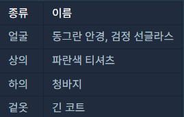

https://school.programmers.co.kr/learn/courses/30/lessons/42578

## 문제 설명
코니는 매일 다른 옷을 조합하여 입는것을 좋아합니다.

예를 들어 코니가 가진 옷이 아래와 같고, 오늘 코니가 동그란 안경, 긴 코트, 파란색 티셔츠를 입었다면 다음날은 청바지를 추가로 입거나 동그란 안경 대신 검정 선글라스를 착용하거나 해야합니다.

코니는 각 종류별로 최대 1가지 의상만 착용할 수 있습니다. 예를 들어 위 예시의 경우 동그란 안경과 검정 선글라스를 동시에 착용할 수는 없습니다.
착용한 의상의 일부가 겹치더라도, 다른 의상이 겹치지 않거나, 혹은 의상을 추가로 더 착용한 경우에는 서로 다른 방법으로 옷을 착용한 것으로 계산합니다.
코니는 하루에 최소 한 개의 의상은 입습니다.
코니가 가진 의상들이 담긴 2차원 배열 clothes가 주어질 때 서로 다른 옷의 조합의 수를 return 하도록 solution 함수를 작성해주세요.

## 제한사항
clothes의 각 행은 [의상의 이름, 의상의 종류]로 이루어져 있습니다.
코니가 가진 의상의 수는 1개 이상 30개 이하입니다.
같은 이름을 가진 의상은 존재하지 않습니다.
clothes의 모든 원소는 문자열로 이루어져 있습니다.
모든 문자열의 길이는 1 이상 20 이하인 자연수이고 알파벳 소문자 또는 '_' 로만 이루어져 있습니다.
## 입출력 예

## 입출력 예 설명
예제 #1
headgear에 해당하는 의상이 yellow_hat, green_turban이고 eyewear에 해당하는 의상이 blue_sunglasses이므로 아래와 같이 5개의 조합이 가능합니다.

1. yellow_hat
2. blue_sunglasses
3. green_turban
4. yellow_hat + blue_sunglasses
5. green_turban + blue_sunglasses
예제 #2
face에 해당하는 의상이 crow_mask, blue_sunglasses, smoky_makeup이므로 아래와 같이 3개의 조합이 가능합니다.

1. crow_mask
2. blue_sunglasses
3. smoky_makeup
